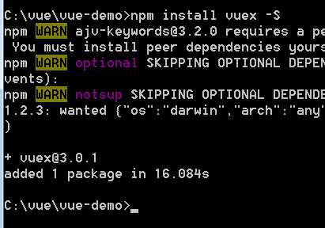
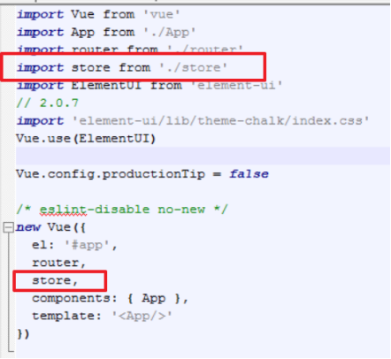
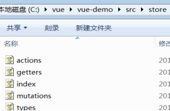

# 安装
根目录运行
~~~
npm install vuex -S
~~~

# 配置
在src/main.js配置vuex
~~~
import store from './store'

new Vue({
  el: '#app',
  router,
  store,
  components: { App },
  template: '<App/>'
})
~~~

src目录新建store文件夹,新建5个js 此处把vuex分成了5个文件

store文件夹下的5个js,里面包含了一个user例子
actions.js 
~~~
import * as types from './types'

// action 存放的是方法
export default {
  getUser: ({
              commit
            }, user) => {
    commit(types.GETUSER, user);
  }
}

~~~
getters.js
~~~
// getters 存放的是变量
export default {
  // 用户个人信息
  user: (state) => state.user,
}
~~~
index.js
~~~
import Vue from 'vue'
import Vuex from 'vuex'
Vue.use(Vuex);
import mutations from './mutations'
import actions from './actions'

export default new Vuex.Store({
  modules: {
    mutations
  },
  actions
});
~~~
mutations.js
~~~
import {
  GETUSER
} from './types'
import getters from './getters'
import * as types from "./types";

const state = {
  // 保存在localstorage中一份,处理f5刷新
  // (后期可学习更方便的方式,目前还不会只能这样了)
  user: window.JSON.parse(localStorage.getItem("user")),
};

// 用于具体改变数据
const mutations = {

  [GETUSER](state, user) {
    state.user = user;
    localStorage.setItem("user", window.JSON.stringify(user));
  }
};

export default {
  state,
  mutations,
  getters
}

~~~
types.js
~~~
export const GETUSER = 'GETUSER';
~~~