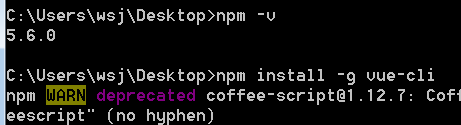
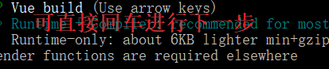
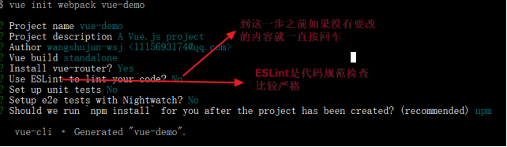
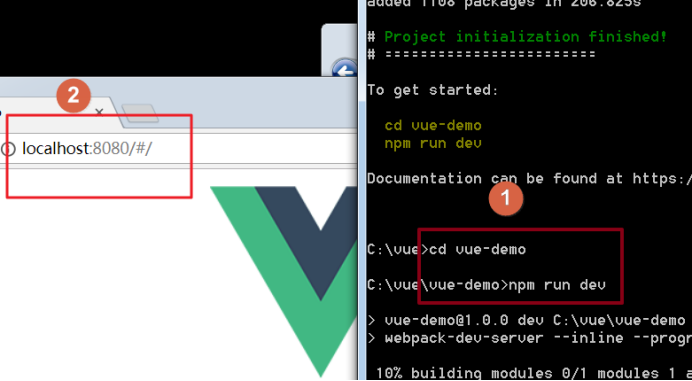

# 1. 全局安装vue-cli
~~~
npm install -g vue-cli

-g 表示全局安装
~~~

# 2 初始化vue项目

vue-demo是项目名称(安装时可修改)
~~~
vue init webpack vue-demo
~~~
注意这一步骤

完整步骤

[关于eslint使用规则，和各种报错对应规则](https://www.jianshu.com/p/421c66111c06)
# 3 验证初始化项目是否成功
中间没有报错,初始化结束后 到项目根目录下使用npm run dev  然后再浏览器中用localhost:8080验证是否成功
