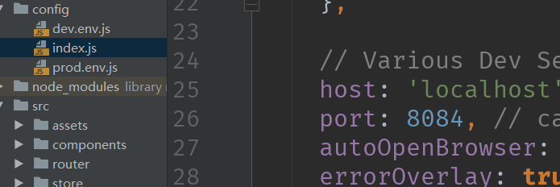
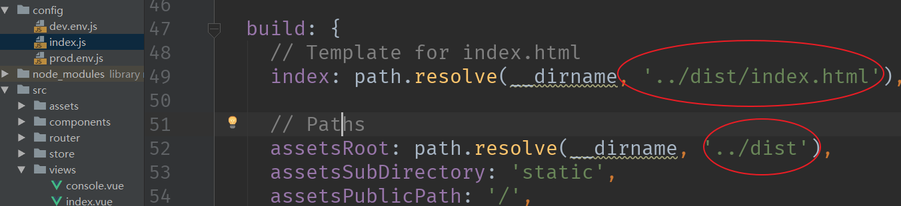

# 修改dev运行的端口号

# 修改build的文件位置

# 学习地址
[vue官网](https://cn.vuejs.org/ )
[vue快速入门的三个小实例](https://segmentfault.com/a/1190000010801357)
[VUE的MVVM框架解析](http://www.cnblogs.com/carr-css/p/6140450.html)
[JavaScript廖雪峰教程](https://www.liaoxuefeng.com/)
[MDN JavaScript](https://developer.mozilla.org/zh-CN/docs/Web/JavaScript)
[es6 入门 阮一峰](http://www.ruanyifeng.com/blog/2014/04/ecmascript_6_primer.html)
[各种页面常见布局+知名网站实例分析+相关阅读推荐](https://github.com/Sweet-KK/css-layout)
[es5标准中文文档](http://lzw.me/pages/ecmascript/#31)
[掘金](https://juejin.im/timeline)
[冴羽写博客的地方，预计写四个系列：JavaScript深入系列、JavaScript专题系列、ES6系列、React系列。](https://github.com/mqyqingfeng/Blog)

